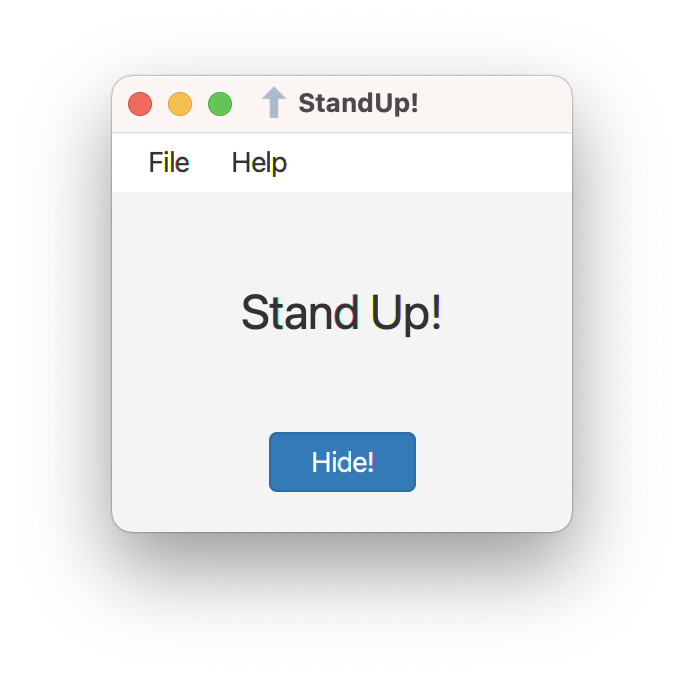
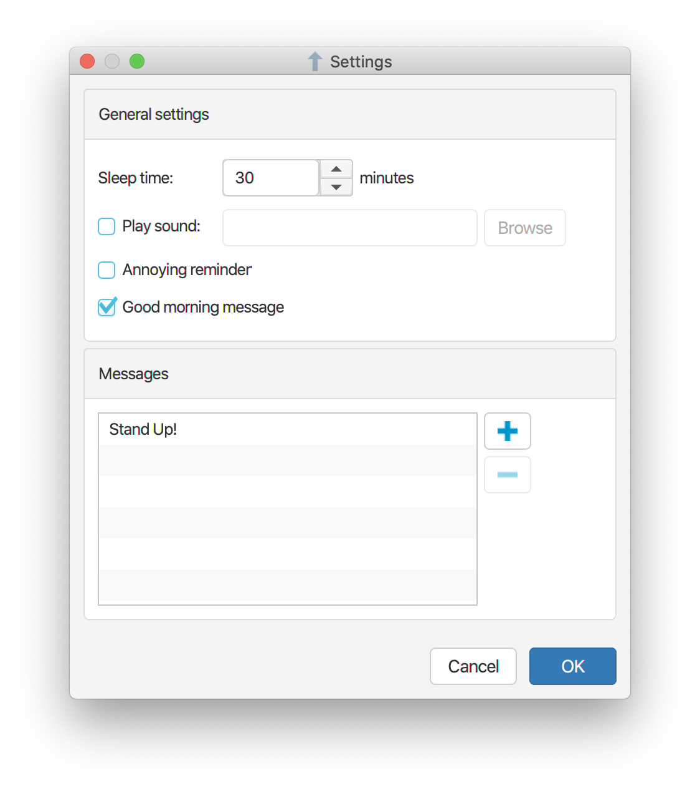

# StandUp

StandUp is a small application that will periodically remind you to stand up and leave your desk for a moment. StandUp is licensed under the [Apache License, Version 2.0](https://www.apache.org/licenses/LICENSE-2.0).


## System Requirements

Java 17 -- download from [Adoptium](https://adoptium.net) or [jdk.java.net](https://jdk.java.net).


## Installing

Download the latest archive file matching your OS from the GitHub [releases page](https://github.com/dykstrom/standup/releases), and extract it somewhere on your hard drive.


## Using

Double-click the JAR file, or start it from the command line.

```
java -jar standup-<version>.jar
```

Replace `<version>` with the version of StandUp you installed, for example 5.0.0.



Click the `Hide` button to hide the application window and be reminded later. Click `File | Settings...` to configure things like how often you want to be reminded, and what messages to display. Enjoy!



---

[JavaFX](https://openjfx.io) GUI styled with [jbootx](https://github.com/dicolar/jbootx) theme. Icons from [iconsDB.com](https://www.iconsdb.com) in colors <span style="color:#286090">#286090</span> and <span style="color:#0096C9">#0096C9</span>.

[](https://github.com/dykstrom/standup/actions/workflows/maven.yml)


[](https://adoptium.net)
